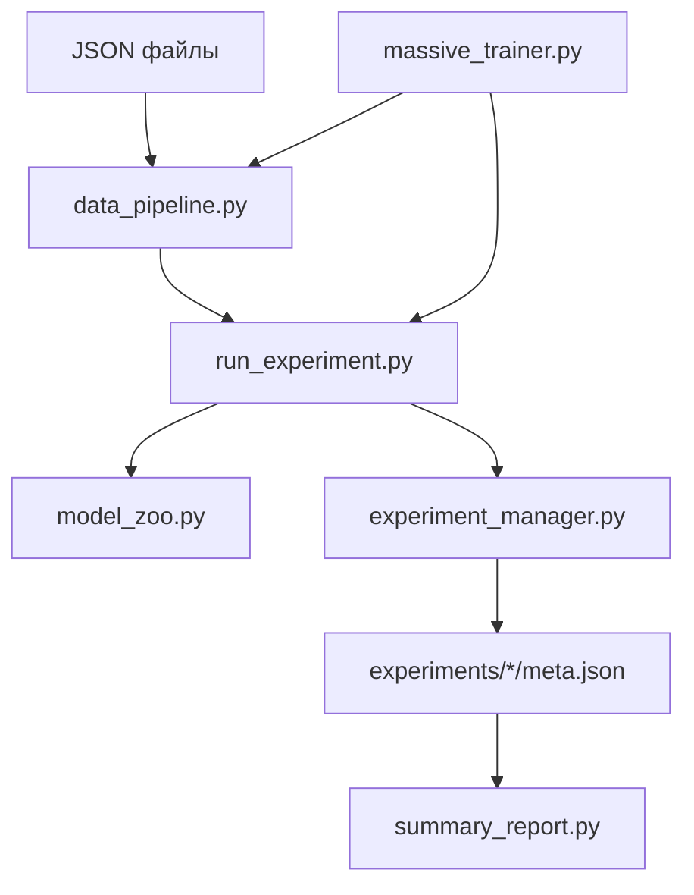

# README – Система обучения и анализа моделей движения (RAE, Transformer, VAE, Analyzer)

**Версия 2.0 | Апрель 2026**

Этот документ содержит полное описание системы для разработчика, который будет её поддерживать и развивать. Объяснены цели, архитектурные решения, структура файлов и пошаговые инструкции.

---

## Оглавление

1. [Назначение системы](#1-назначение-системы)
2. [Общая архитектура](#2-общая-архитектура)
3. [Пофайловое описание](#3-пофайловое-описание)
   - 3.1. `model_zoo.py`
   - 3.2. `data_pipeline.py`
   - 3.3. `experiment_manager.py`
   - 3.4. `run_experiment.py`
   - 3.5. `massive_trainer.py`
   - 3.6. `summary_report.py`
   - 3.7. `test_system.py`
4. [Как использовать систему](#4-как-использовать-систему)
   - 4.1. Установка и первый запуск
   - 4.2. Обучение одной модели
   - 4.3. Массовое обучение
   - 4.4. Анализ результатов
5. [Ключевые архитектурные решения](#5-ключевые-архитектурные-решения)
6. [Рекомендации по развитию](#6-рекомендации-по-развитию)

---

## 1. Назначение системы

Система решает задачу **автоматического анализа правильности выполнения физических упражнений** по видеозаписям. Видео предварительно обработаны с помощью YOLO – извлечены координаты 13 ключевых точек тела, вычислены векторы сегментов и углы между ними. Результат сохранён в JSON-файлах (один файл на тип упражнения, содержащий много видео).

**Цели системы:**

- Обучить нейросетевые модели восстанавливать «правильные» последовательности поз (автоэнкодеры).
- Использовать ошибку восстановления как меру «аномальности» движения.
- Для каждого сустава определить наличие и направление отклонения от эталона.
- Автоматически перебирать гиперпараметры для поиска лучших моделей.
- Сохранять результаты экспериментов в структурированном виде для последующего анализа.

---

## 2. Общая архитектура

Система построена по модульному принципу. Каждый модуль отвечает за свою задачу и может использоваться независимо.



**Ключевые связи:**

- `data_pipeline.py` – единственное место, где читаются JSON и создаются DataLoader'ы.
- `model_zoo.py` – все архитектуры моделей, унифицированный интерфейс (forward возвращает восстановленную последовательность).
- `experiment_manager.py` – хранилище метаданных, заменяет CSV.
- `run_experiment.py` – скрипт обучения одной модели, принимает параметры через аргументы командной строки.
- `massive_trainer.py` – запускает множество экземпляров `run_experiment.py` параллельно, распределяя по GPU.
- `summary_report.py` – анализирует папку `experiments/` и строит отчёты.

---

## 3. Пофайловое описание

### 3.1. `model_zoo.py`

**Что делает:** Содержит классы всех нейросетевых моделей.

**Архитектурные решения:**

- **RAE** – классический LSTM-автоэнкодер. Декодер работает **авторегрессионно**: на каждом шаге на вход подаётся предыдущий сгенерированный кадр. Это улучшает качество восстановления длинных последовательностей.
- **TransformerAE** – использует энкодер Transformer и декодер Transformer. Позиционное кодирование добавлено. Подходит для захвата глобальных зависимостей.
- **LSTM-VAE** – вариационная версия, даёт вероятностную оценку аномалии через KL-дивергенцию.
- **ExerciseAnalyzer** – надстройка над предобученным энкодером. Добавляет бинарные классификаторы для каждого сустава. Используется для точной локализации ошибок.

**Как расширять:** Добавить новый класс, наследующий `nn.Module`, реализовать `forward`, затем зарегистрировать в `get_model()` в `run_experiment.py`.

---

### 3.2. `data_pipeline.py`

**Что делает:** Вся предобработка данных.

**Режимы признаков:**
- `use_full_features=False` – только 11 углов.
- `use_full_features=True` – 44 признака: нормализованные векторы (22), нормализованные длины (11), углы (11).

**Ключевые моменты:**
- Разделение train/test происходит **по видео**, а не по кадрам. Это предотвращает утечку данных.
- `SequenceDataset` применяет **z-score нормализацию** по каждому признаку независимо.
- Функция `get_dataloaders` – единая точка входа для всех моделей.

**Как использовать:**
```python
from data_pipeline import get_dataloaders
train_loader, test_loader = get_dataloaders('datasets/squat.json', seq_len=30, use_full_features=True)
```

---

### 3.3. `experiment_manager.py`

**Что делает:** Заменяет CSV. Каждый эксперимент – отдельная папка с `meta.json`.

**Структура папки:**
```
experiments/
└── a1b2c3d4/
    ├── meta.json
    ├── error.log
    └── best_model.pth (опционально)
```

**Преимущества перед CSV:**
- Не портится при параллельной записи.
- Легко добавлять новые поля.
- Можно хранить артефакты (модели, графики).
- Простое удаление (`rm -rf experiments/a1b2c3d4`).

**Как использовать:**
```python
from experiment_manager import manager
exp_id = manager.create_experiment('rae', 'squat', {'lr': 0.001})
manager.update_status(exp_id, 'completed', best_test_loss=0.0123)
```

---

### 3.4. `run_experiment.py`

**Что делает:** Обучает одну модель с заданными параметрами. Это основной скрипт, который вызывается при любом обучении.

**Параметры:** Все гиперпараметры передаются через аргументы командной строки (см. `--help`).

**Особенности:**
- Автоматически определяет `input_dim` по первому батчу.
- Сохраняет лучшую модель по `val_loss`.
- Интегрирован с `ExperimentManager`: создаёт или обновляет эксперимент.
- Поддерживает раннюю остановку и ReduceLROnPlateau.

**Как использовать:**
```bash
python run_experiment.py --model_type rae --json_file datasets/lateral_raise.json --epochs 100
```

---

### 3.5. `massive_trainer.py`

**Что делает:** Запускает `run_experiment.py` для всех упражнений (или выбранных) параллельно.

**Управление GPU:** Использует циклический выбор `gpu_id` из доступных через `torch.cuda.device_count()`.

**Стратегии перебора:** Пока поддерживается только фиксированный набор параметров (можно расширить).

**Как использовать:**
```bash
python massive_trainer.py --model_type all --workers 6 --use_full_features
```

**Внутреннее устройство:**
- Создаёт очередь задач.
- Запускает N воркеров (потоков), каждый воркер запускает `subprocess.Popen` с командой `run_experiment.py`.
- Отслеживает завершение и обновляет статусы через `ExperimentManager`.

---

### 3.6. `summary_report.py`

**Что делает:** Анализирует все завершённые эксперименты в `experiments/` и генерирует отчёты.

**Возможности:**
- Топ-N лучших моделей по упражнению.
- Сравнение архитектур (средний loss).
- Экспорт в CSV.

**Как использовать:**
```bash
python summary_report.py --top_n 3 --export_csv best_models.csv
```

---

### 3.7. `test_system.py`

**Что делает:** pytest-тесты для всех модулей. Покрывает:
- Загрузку данных (включая пустые JSON).
- Разделение train/test.
- Forward и backward проходы всех моделей.
- Корректность работы `ExperimentManager`.

**Как запускать:**
```bash
pytest test_system.py -v
```

---

## 4. Как использовать систему

### 4.1. Установка и первый запуск

```bash
# 1. Клонировать репозиторий (или скопировать файлы)
cd projects

# 2. Создать виртуальное окружение
python -m venv venv
source venv/bin/activate

# 3. Установить зависимости
pip install torch numpy matplotlib pytest

# 4. Проверить работоспособность
pytest test_system.py -v   # должно быть 17 passed
```

### 4.2. Обучение одной модели

```bash
python run_experiment.py \
    --model_type rae \
    --json_file datasets/lateral_raise.json \
    --epochs 50 \
    --gpu_id 0
```

Результаты сохранятся в `models/...` и `experiments/`.

### 4.3. Массовое обучение

```bash
python massive_trainer.py \
    --model_type all \
    --workers 6 \
    --epochs 30 \
    --use_full_features
```

### 4.4. Анализ результатов

```bash
# Топ-5 моделей по всем упражнениям
python summary_report.py --top_n 5 --export_csv top5.csv

# Сравнение архитектур
python summary_report.py --compare_architectures
```

---

## 5. Ключевые архитектурные решения

| Решение | Причина |
|---------|---------|
| Разделение train/test по видео | Предотвращает утечку данных (кадры одного видео сильно коррелированы) |
| Z‑score нормализация вместо Min‑Max | Углы могут выходить за пределы `[0, π]` из-за шума, z‑score устойчивее |
| Авторегрессионный декодер в RAE | Улучшает моделирование временной динамики |
| Хранение экспериментов в отдельных папках | Надёжнее CSV, позволяет хранить артефакты, легко удалять |
| Циклическое распределение GPU | Максимальная утилизация всех карт без сложной логики |
| Единый `run_experiment.py` | Упрощает поддержку – не нужно отдельных скриптов под каждую модель |

---

## 6. Рекомендации по развитию

1. **Добавить Optuna для автоматического подбора гиперпараметров.** Уже есть заготовка `hyper_optim.py`.
2. **Реализовать детектор ошибок на основе обученных автоэнкодеров** (без учителя). Для каждого сустава вычислить порог ошибки восстановления.
3. **Добавить визуализацию скелета с подсветкой аномальных суставов.**
4. **Интегрировать с веб‑дашбордом** (обновить `app.py` для чтения `ExperimentManager`).
5. **Расширить `summary_report.py`** – строить графики распределения ошибок, времени обучения.

---

Этот документ должен дать полное понимание системы новому разработчику. При возникновении вопросов обращаться к автору исходной версии.